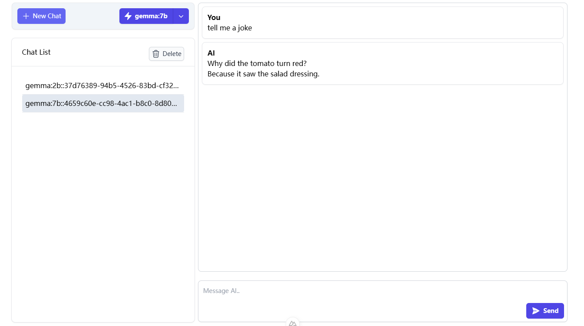

# ramChat for Ollama

## About

It is an open source and minimal chat UI for Ollama. UI Uses Ollama stream API. Based on Vue3.js, Nuxt3.js,Taillwindcss, Nuxtui.

[Reference the Repo => nuxt-ollama-chat](https://github.com/apoStyLEE/nuxt-ollama-chat)



## Running Localy

### 1. Clone Repo

```bash
git clone https://github.com/lingdu2012/ramOllama.git
```

### 2. Install Dependencies

```bash
# npm
npm install

# pnpm
pnpm install

# yarn
yarn install

# bun
bun install
```

### 3. Run Ollama server

Either via the cli:

```bash
ollama serve
```

or via the [desktop client](https://ollama.com/download)

### 4. Run App (Development Server)

Start the development server on `http://localhost:3000`:

```bash
# npm
npm run dev

# pnpm
pnpm run dev

# yarn
yarn dev

# bun
bun run dev
```

Check out the more information

[Nuxt.js Documentation](https://nuxt.com/docs/getting-started/deployment)

[NuxtUI Documentation](https://ui.nuxt.com/getting-started)

[Ollama Documentation](https://ollama.com)

[Taillwindcss Documentation](https://www.tailwindcss.cn/docs/installation)
